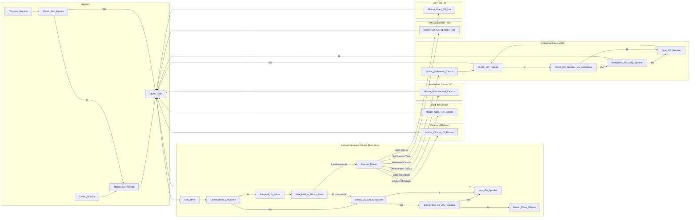

# testgit

This is the master branch

# Motion Checklist
* [ ] Motion for Closure of the Debate
* [ ] Motion to Table the Debate
* [ ] Motion for Adjournment of the Meeting
* [ ] Motion for Suspension of the Meeting
* [ ]  Motion to Resume Debate
* [ ] Motion to Introduce an Amendment
* [ ] Motion to Introduce a Working Paper
* [x] Motion for Un-moderated Caucus (its Extension has precedence)    
* [x] Motion for Moderated Caucus (its Extension has precedence)       
* [x] Motion to Change the Speaking Time                              
* [x] Motion to Open the Speaker´s List                               

In order after the Closure of the Debate:

* [ ] Motion to Reorder Draft Resolutions
* [ ] Motion to Divide the Question
* [ ] Motion for the Roll Call

# State Machine for Model UN Procedural Rule

